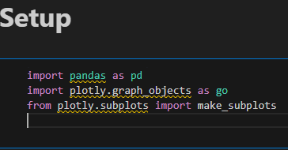
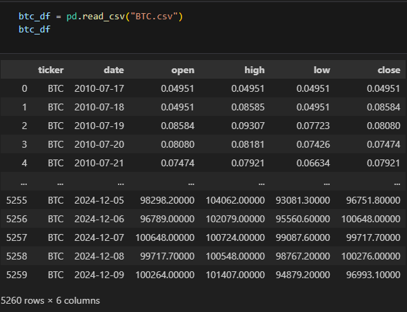
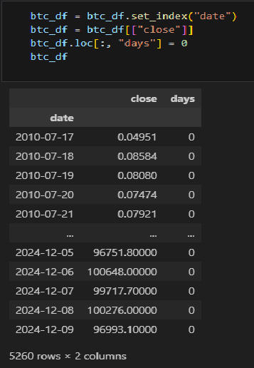
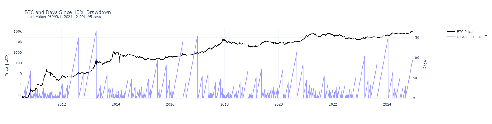
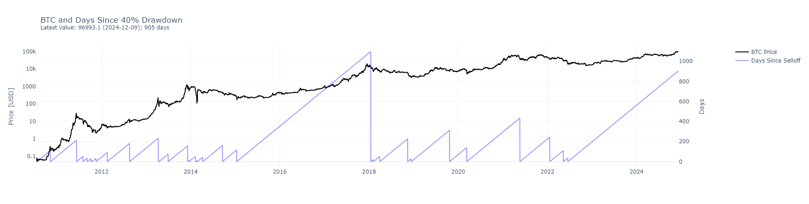
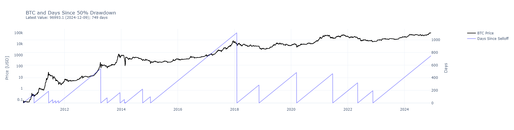

# Caidas y periodos de recuperacion en el precio de Bitcoin

<h1>Contenidos</h1>

    <ul>
        <li>
            <a href="#Introducción">Introducción</a>
        </li>
        <li>
            <a href="#Exploración">Exploración</a>
            <ul>
                <li><a href="#Librerías-utilizadas">Librerías utilizadas</a></li>
                <li><a href="#Dataset-utilizado">Dataset utilizado</a></li>
                <li><a href="#Estructura-del-dataset">Estructura del dataset</a></li>
            </ul>
        </li>
        <li>
            <a href="#Transformacion">Transformacion</a>
        </li>
        <li>
            <a href="#Visualización">Visualización</a>
           <ul>
    <li><a href="#ejemplo-caidas-10">Ejemplo midiendo caídas del 10%</a></li>
    <li><a href="#ejemplo-caidas-40">Ejemplo midiendo caídas del 40%</a></li>
    <li><a href="#ejemplo-caidas-50">Ejemplo midiendo caídas del 50%</a></li>
</ul>
    </ul>

# **Introducción**

Este análisis centrado en los precios históricos de Bitcoin ofrece una perspectiva sobre los ciclos de este mercado y las dinámicas de recuperación tras grandes caídas. El objetivo es identificar y estudiar las caídas significativas en el precio de Bitcoin desde 2010 hasta 2024, así como el tiempo que tarda en recuperarse a niveles previos. 
Los gráficos generados en este análisis permiten:

1. **Visualizar caídas significativas:** Identificar momentos en los que el precio de Bitcoin experimentó disminuciones mayores a un cierto porcentaje predefinido, como un 10%.
2. **Rastrear períodos de recuperación:** Medir la cantidad de días que el precio tarda en superar su máximo histórico previo, proporcionando una métrica clara sobre la duración y el impacto de las caídas en el precio del Bitcoin.
3. **Analizar patrones históricos:** Observar si existen tendencias en la duración y frecuencia de los períodos de caída y recuperación a lo largo del tiempo.

Estos resultados son útiles para:
- Inversionistas que desean comprender la resiliencia histórica del mercado de Bitcoin frente a caídas significativas.
- Analistas interesados en estudiar patrones de recuperación en mercados volátiles.
- Personas curiosas por explorar el comportamiento del mercado de Bitcoin a lo largo de su historia.

 

# Exploración
### Librerías utilizadas

### Dataset utilizado
El dataset proviene de Kaggle y contiene datos históricos del precio de Bitcoin y de otras criptomonedas, organizados por fecha. La fuente original del dataset es: https://www.kaggle.com/datasets/svaningelgem/crypto-currencies-daily-prices/data

## Estructura del dataset
dataset original:

Explicación de las columnas importantes del dataset:
1. ticker
-	Representa el símbolo del activo que se está analizando. En este caso, BTC se refiere a Bitcoin.
2. date
-	La fecha de los datos registrados. Cada fila representa la información del precio de Bitcoin para un día específico.

3. close
-	Es el precio de cierre del día.
-	Este es el precio al que se realizó la última transacción del día (normalmente justo antes de la medianoche UTC).

 

# Transformacion

Para nuestro análisis, sólo necesitaremos la columna "close", la columna 'date' se va a convertir en el indice del dataframe y también vamos a crear la columna "days".

El conteo de la columna days indica cuántos días consecutivos han pasado desde que ocurrió la última caída significativa (igual o mayor al porcentaje especificado). Es un indicador del tiempo que el mercado lleva recuperándose sin una caída importante. Esta columna se calcula utilizando una funcion la cual es central en nuestro proyecto y que se encuentra en el notebook del mismo. Los dias se cuentan dependiendo del porcentaje especificado de caiga que se quiera medir.

 

# Visualización

Los gráficos ofrecen una perspectiva visual sobre la volatilidad histórica del mercado de Bitcoin.

#### Interpretación del gráfico

- **BTC Price** (línea negra): Ayuda a identificar los picos y las caídas significativas en el precio de Bitcoin.
- **Days Since Selloff** (línea azul): Permite rastrear cuánto tiempo ha pasado desde la última caída importante. Un aumento continuo en esta línea significa un período continuo de recuperación y una caida indica que ha ocurrido una caiga en el porcentaje especificado.

Ambos indicadores juntos proporcionan información valiosa sobre la duración y la intensidad de las caídas en el mercado.

<h2 id="ejemplo-caidas-10">Ejemplo midiendo caídas del 10%</h2>

<h2 id="ejemplo-caidas-40">Ejemplo midiendo caídas del 40%</h2>

<h2 id="ejemplo-caidas-50">Ejemplo midiendo caídas del 50%</h2>

# **Conclusión**
Los gráficos generados en este análisis muestran que Bitcoin ha experimentado numerosas caídas significativas a lo largo de su historia, algunas de ellas superiores al 50% de su valor. Sin embargo, en cada caso, el activo ha logrado recuperarse y superar sus máximos anteriores. Este comportamiento refleja la resiliencia del mercado de Bitcoin y su capacidad para atraer nueva inversión y confianza después de períodos de incertidumbre. Aunque la volatilidad sigue siendo una característica inherente, los datos históricos sugieren que, a largo plazo, Bitcoin ha tendido a mantener una trayectoria ascendente, consolidándose como un activo único en el panorama financiero global.
